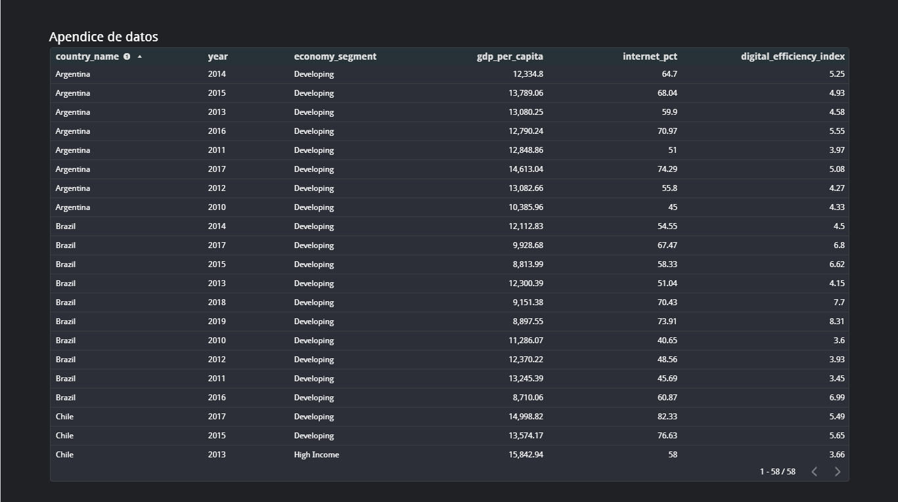
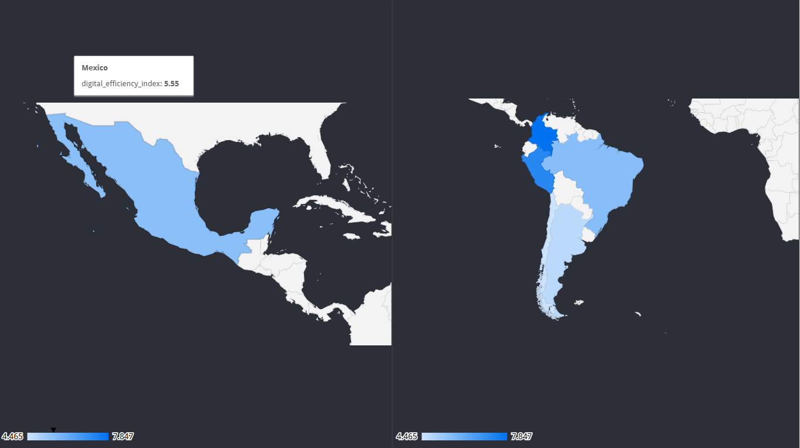
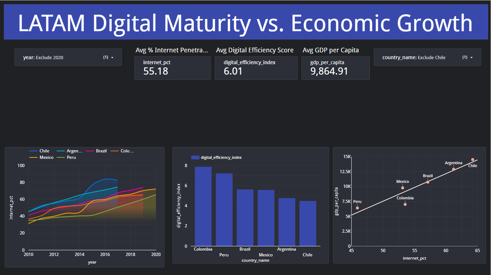

# 📊 LATAM Digital Maturity Analysis

**Tools:** Google BigQuery (SQL), Looker Studio, GitHub
**Data Source:** World Bank Open Data (Public Dataset)

---

## 🚀 Project Overview
Does economic wealth guarantee digital adoption? This project analyzes 10+ years of economic and technological data to identify **"efficiency gaps"** in Latin America. 

The goal was to answer a key business question: *Which countries are digitizing faster than their economy predicts?*

## 💼 Key Insights & Business Value
1.  **🇲🇽 The Mexico Opportunity:** Despite having a high GDP (comparable to Brazil), Mexico consistently falls below the trendline for digital adoption. This "Infrastructure Gap" represents a massive untapped market for digital services.
2.  **🇨🇱 Chile as Benchmark:** The only nation in the dataset to achieve both "High Income" status and >80% Internet Penetration, serving as the predictive model for the region.
3.  **🇨🇴 The Efficiency Paradox:** Developing economies like Colombia show a higher "Digital ROI" (Efficiency Index) than wealthier nations, indicating a population that prioritizes connectivity.

---

## 🛠️ Technical Implementation

### 1. Data Engineering (BigQuery & SQL)
* **Architecture:** Used Common Table Expressions (CTEs) to isolate GDP and Internet metrics.
* **Transformation:** Performed a `SELF-JOIN` on the raw dataset to pivot the data from a "tall" format to a "wide" analytical table.
* **Feature Engineering:** Created the custom KPI `digital_efficiency_index` to normalize internet usage against GDP per capita.

### 2. Visualization (Looker Studio)
Designed an interactive dashboard using the **"F-Pattern" layout** for executive reporting.
* **Executive Summary:** High-level KPIs and historical trends.
* **Geospatial Analysis:** Dark-mode choropleth map to visualize regional efficiency.
* **Correlation Analysis:** Scatter plot with trendlines to identify market outliers.

---

## 📸 Dashboard Preview

### Executive Dashboard

### Geospatial Efficiency Map

### Correlation Analysis (Wealth vs. Connectivity)

---

## 💻 SQL Logic 
*Full code available in the `/sql` folder.*

